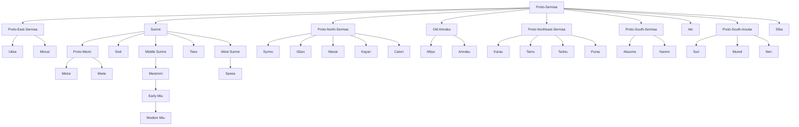

```mermaid
graph TD
    psm[Proto-Sermaa] --> pesm[Proto-East-Sermaa]
    psm --> sum[Sumre]
    psm --> pnsm[Proto-North-Sermaa]
    psm --> oa[Old Amraku]
    psm --> lnsm[Proto-Northeast-Sermaa]
    psm --> pssm[Proto-South-Sermaa]
    psm --> akr[Akr]
    psm --> sism[Proto-South-Insular]
    psm --> sb[Sîba]

    pesm --> Ukka[Ukka]
    pesm --> Minusi

    sum --> msum[Middle Sumre]
    sum --> siv[Sivè]
    sum --> pmz[Proto-Mezic]
    sum --> ts[Tsiex]
    pmz --> ltu[Mėice]
    pmz --> lat[Miete]
    msum --> mes[Mesimmi]
    mes --> miu[Early Miu]
    miu --> miu2[Modern Miu]
    sum --> wsum[West Sumre]
    wsum --> Sanea

    pnsm --> sy[Syrmu]
    pnsm --> is[Iššun]
    pnsm --> mnt[Manat]
    pnsm --> ky[Kayari]
    pnsm --> ct[Catori]

    oa --> my[Miiye]
    oa --> sa[Amraku]

    lnsm --> Karau
    lnsm --> Tamu
    lnsm --> Tarbiu
    lnsm --> Puras

    pssm --> Abusma
    pssm --> Narem

    sism --> Suri
    sism --> Mured
    sism --> Neri
```
